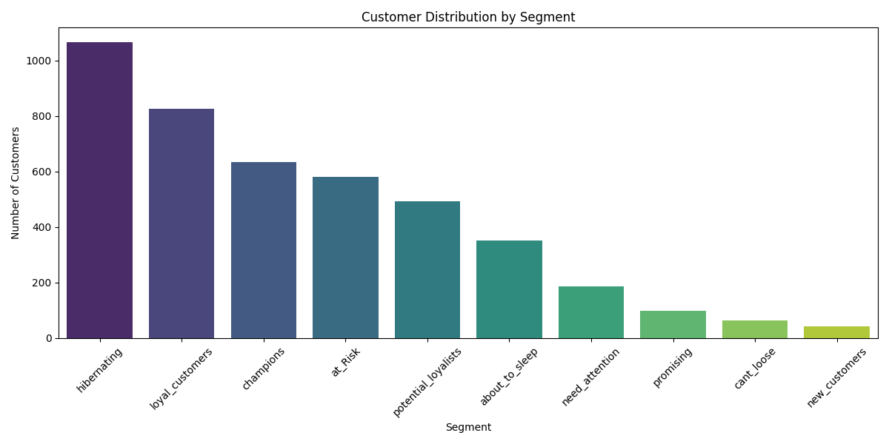

# E-Commerce Customer Segmentation using RFM Analysis

An end-to-end Data Analytics project designed to segment e-commerce customers based on their transaction behaviors using **RFM (Recency, Frequency, Monetary)** modeling. This project transforms raw transactional data into actionable marketing insights and strategic business decision-making tools.

---

## Project Overview & Business Value


In the e-commerce industry, understanding customer behavior is essential for targeted marketing, reducing churn, and maximizing Customer Lifetime Value (CLV). Instead of treating all customers equally, this pipeline segments users into 10 actionable behavioral categories (e.g., *Champions*, *At Risk*, *Cant Lose Them*, *Hibernating*).

---

## Dataset Information

* **Source:** UCI Machine Learning Repository — Online Retail Dataset
* **Content:** Transactional data containing online retail transactions.
* **Key Features:**
  * `InvoiceNo`: Unique invoice number per transaction.
  * `Quantity`: Quantity of product per transaction.
  * `InvoiceDate`: Timestamp of transaction.
  * `UnitPrice`: Product price per unit.
  * `CustomerID`: Unique identifier per customer.

---

## Data Pipeline & Methodology

1. **Data Cleaning & Preprocessing:**
   * Filtered missing `CustomerID` records.
   * Handled cancellations (`Quantity > 0`) and pricing errors (`UnitPrice > 0`).
   * Generated total spend feature (`TotalPrice = Quantity * UnitPrice`).

2. **RFM Metrics Calculation:**
   * **Recency (R):** Days elapsed since the customer's last purchase relative to analysis date.
   * **Frequency (F):** Total number of unique orders placed by the customer.
   * **Monetary (M):** Total monetary value generated by the customer.

3. **Scoring & Segment Mapping:**
   * Discretized metrics into 1–5 quantiles using `pd.qcut()`.
   * Mapped combined RFM scores into business-oriented customer segments using regular expressions (Regex).

4. **Data Export & Visualization:**
   * Exported customer-level structured segments to `rfm_results.csv`.
   * Generated segment-level summary statistics and visual distribution charts using `Seaborn`.

---

## Technologies Used

* **Language:** Python 3.14+
* **Data Manipulation:** Pandas
* **Visualization:** Seaborn, Matplotlib

---

## How to Run

1. Clone the repository:
   ```bash
   git clone [https://github.com/kaan66tarikk-coder/e-commerce-rfm-customer-segmentation.git](https://github.com/kaan66tarikk-coder/e-commerce-rfm-customer-segmentation.git)
